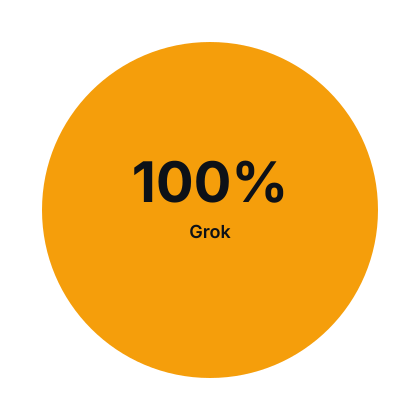

# craidt

Split-screen agentic commerce: **buyer agent** on the left, **Shopify UCP merchants** on the right, prompt bar along the bottom.

Purchase settles on **Stripe** (ACP-demo test-card flow). Merchant incentives, cashback, and ERC-8004 identity live on **Ethereum Sepolia**. Ranking still uses midnightx402 **Net Human Cost** with a conserved **60% user / 40% agent** split.

**Live demo:** [craidt-railway-production.up.railway.app](https://craidt-railway-production.up.railway.app)

```bash
cp .env.example .env   # then add STRIPE_SECRET_KEY=sk_test_… if you want live test charges
npm run demo
```

Open [http://localhost:5180](http://localhost:5180) locally, or the Railway URL above. The buyer chat captures intent with **OpenAI** first (`OPENAI_API_KEY`). Shopify UCP does not run until the agent has a **product** and a **budget**. Vague prompts like "it's raining and I want to go out" stay on the buyer side until they pick (umbrella vs boots) and name a budget.

Without a Stripe key the charge is simulated; with `sk_test_…` it confirms Visa `···4242` like ACP-demo.

## Cursor model tracker

Commits made through Cursor are counted by **model**, using a `Model:` trailer in the commit message. The chart below is regenerated from git history on every push to `main`.



Each mosaic square is one commit, colored by model. Gray / **Unattributed** commits have no `Model:` trailer (including human-authored ones).

### Required: name the model on every AI commit

Any AI model committing to this repo — including Cursor agents — **must** mention its name. Put it in the commit **body** as a git trailer, after a blank line:

```
Short summary of the change.

Optional body explaining why.

Model: Cursor Grok 4.6
```

Use your actual product name, not a generic label like "AI" or "Cursor Agent". Examples:

| Model | Trailer |
| --- | --- |
| Grok | `Model: Cursor Grok 4.6` |
| Claude | `Model: Claude 4 Sonnet` |
| GPT | `Model: GPT-5` |
| Composer | `Model: Composer` |
| Gemini | `Model: Gemini 2.5 Pro` |

Do not impersonate another model. Human commits may omit the trailer; they appear as **Unattributed**.

From a shell, the trailer looks like this:

```bash
git commit -m "$(cat <<'EOF'
Add the feature.

Model: Cursor Grok 4.6
EOF
)"
```

### Regenerating locally

```bash
node scripts/generate-model-tracker.mjs
```

That writes `assets/model-tracker.svg`. GitHub Actions runs the same command on push so the README chart stays current.
